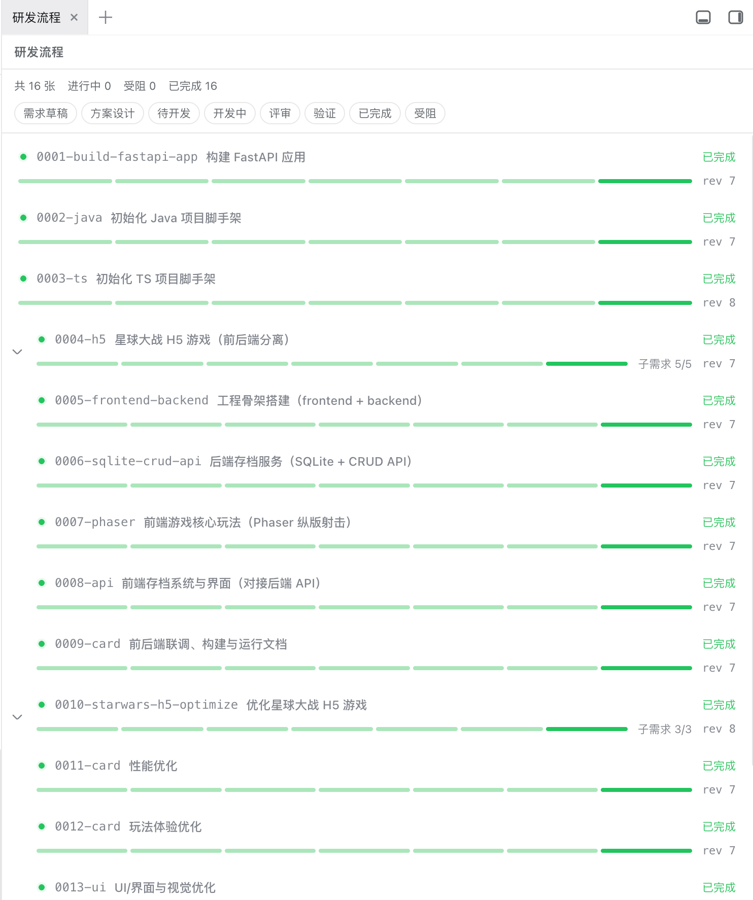
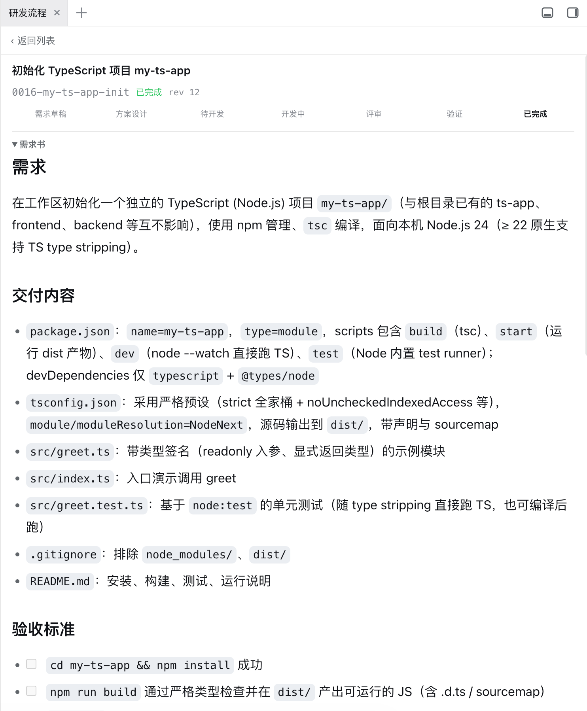
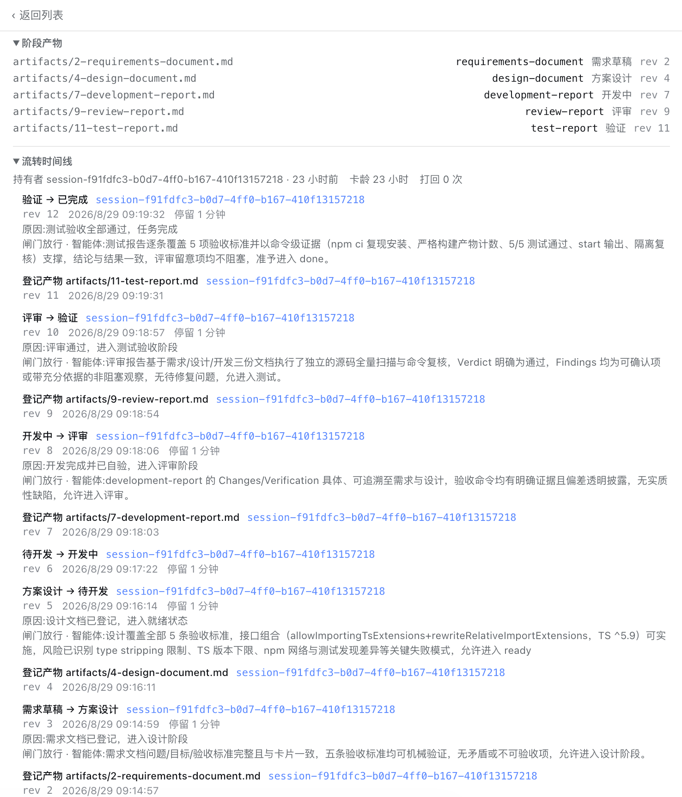

# devflow for DeepSeek Harness

English | [中文](README.md)

File-based development state for [DeepSeek Harness](https://github.com/deepseek-ai/deepseek-harness): work is a **card**, a card's history is an append-only journal, and every stage move commits at that journal. Eleven runtime plugins over one capability seam (`ctx.devflow`), plus one declarative install bundle; the Harness agent is the workflow executor.

This repository is the standalone plugin line. It depends only on harness packages published to npm — nothing here patches the harness.

## The packages

| Package | Role |
|---|---|
| `@zhchxiao123/dsh-devflow` | Service Definition of the `ctx.devflow` seam: card vocabulary, journal decode/replay |
| `@zhchxiao123/dsh-devflow-filesystem` | Service Provider: `.devflow/` on disk, `O_EXCL` leases, month-bucket archiving |
| `@zhchxiao123/dsh-devflow-gates` | Gate policy on the transition waterfall: per-edge commands plus one-shot human approvals |
| `@zhchxiao123/dsh-devflow-parent-gate` | Completion policy: a decomposed requirement reaches `done` only after every sub-requirement does |
| `@zhchxiao123/dsh-devflow-fs-guard` | Denies the agent's file tools any write under `.devflow/`, keeping the store the only write path |
| `@zhchxiao123/dsh-devflow-artifact-gate` | Mechanical artifact contract over configured transition edges |
| `@zhchxiao123/dsh-devflow-agent-gate` | Independent LLM admission checks over registered artifacts |
| `@zhchxiao123/dsh-devflow-tool` | The model-facing tools (`devflow_list`, `devflow_create`, `devflow_transition`, …) |
| `@zhchxiao123/dsh-devflow-command` | The deterministic `/devflow` intervention plane |
| `@zhchxiao123/dsh-devflow-web` | devflow's own browser channel: a read-only JSON route plus a change stream |
| `@zhchxiao123/dsh-devflow-ui` | The board, browser half: a sidebar page where a sidebar foundation is composed, a floating control otherwise |

Three planes move a card and they are separate on purpose: the model uses the tools, a human intervenes through `/devflow`, and approvals ride the harness's approval plane. The web board is **read-only** — the route projects two reads and no write verb has an endpoint at all.

## Harness version

Every Harness and Cordis dependency is pinned to the latest adapted baseline: `0.1.2-alpha.3` for `@deepseek-ai/*` and `4.0.2` for Cordis. The board client follows the split `dsh-client-store`, `dsh-client-ui-renderer`, and `dsh-api-session-controller` boundaries and has passed a local tarball boot regression. Dependencies remain explicit instead of floating across pre-1.0 compatibility boundaries.

## Install into a harness

```sh
dsh plugin --profile web add @zhchxiao123/dsh-devflow-bundle
```

That is the whole install: `dsh plugin add` forwards to pnpm and then reconciles the profile's bundle stack against what got installed, so the bundle mounts every devflow row by itself — no profile file to edit. The board comes with it. See [`devflow-bundle`](packages/devflow-bundle/README.md) for what mounts, what ships disabled, and how to override a row.

Install the optional sidebar foundation to get the full tabbed Kanban shown in the screenshots. Harness `0.1.2-alpha.x` requires its alpha channel; `dsh-better-sidebar@0.18.0-alpha.0` and later alpha builds target that Harness line:

```sh
dsh plugin --profile web add dsh-better-sidebar@alpha
```

Without the foundation, devflow falls back automatically to the compact read-only control at the conversation's top-right. Follow the foundation's [official README](https://github.com/omdsh-dev/DSH-better-sidebar#-安装) for its pnpm 11 build approval and version matrix.

## What it looks like in practice

These are real regression-session screenshots from this repository running in DSH Web, not interface mockups.

### Workspace board



The board summarizes card counts and stages while exposing revisions, blocked states, and parent-child work. It is a read-only observation plane; actual transitions still come from the Harness agent's `devflow_*` tools or human commands.

### Card detail

Open any card to inspect its current stage, revision, complete stage rail, requirement body, acceptance criteria, decomposition, and registered artifacts.



### Stage artifacts and transition timeline



The detail view collects the requirements document, design document, development report, review report, and test report. The same timeline records artifact registrations, stage changes, revisions, timestamps, dwell times, transition reasons, and gate results, making the card's complete path from draft to done directly auditable.

## Plugin marketplace information

**Value:** Give the Harness agent a durable, inspectable development workflow with file-backed cards, revision-safe transitions, optional artifact and admission checks, human intervention, and a read-only web board.

| Item | Support |
|---|---|
| Install package | `@zhchxiao123/dsh-devflow-bundle` |
| Profile | `web` for the complete bundle; server-side packages may be composed separately |
| Harness compatibility | Locally boot-tested with `@deepseek-ai/*` `0.1.2-alpha.3`; Cordis `4.0.2` |
| Full Kanban page | Optionally install `dsh-better-sidebar@alpha`; real-sidebar tested with `0.18.0-alpha.0` |
| Node.js | `^22.19` or `>=24` |
| Local data | Reads and writes `.devflow/` under each caller's workspace; no project source files are modified by the store |
| Network and models | No telemetry or bundled third-party service; the optional agent check uses the model provider already configured in Harness |
| Commands | The optional command check runs only commands explicitly configured by the profile owner |
| Defaults | Artifact, agent, command, and approval checks are mounted but disabled until the profile defines their policy |

The install entry is a `dsh.bundle` manifest whose patch mounts the runtime packages. Function plugins export `apply(ctx)` according to the Harness loader contract; service packages export their service class.

With an artifact contract enabled, the model sees requirements before attempting a transition. The [real Loader composition test](packages/devflow-tool/tests/loader-composition.spec.ts) asserts output in this form:

```text
Created card 0001-artifact-flow [draft] Artifact flow (rev 1).
artifact requirements for draft -> designing:
[missing] requirements-document

Card 0001-artifact-flow moved draft -> designing (rev 4).
artifact requirements for designing -> ready:
[missing] design-document
```

## Getting started (development)

```sh
git clone https://github.com/zhchxiao123/dsh-devflow-plugins.git
cd dsh-devflow-plugins
pnpm run init
```

`init` installs against the recorded lockfile, then typechecks, lints, and tests — a clean checkout either reproduces or tells you the harness moved. After that:

```sh
pnpm run verify        # typecheck + lint + test, the pre-push gate
pnpm run test:coverage # per-file 100% on packages/*/src
pnpm run build         # emit lib/types
```

Workspace packages resolve to each other through `tsconfig.base.json` `paths` (the source plane) in tests and typecheck; consumers resolve them through `exports` to built `lib/`.

## Where the work is described

This repository carries its own development record, moved with the code:

| Path | What lives there |
|---|---|
| `.agents/prd/` | six PRDs — what each change set was for and what was ruled out |
| `.scratch/devflow/` | 22 issues sliced from those PRDs, each with its resolution |
| `.agents/notes/implemented/` | Agent Notes — the decisions, the alternatives, and why |
| `.agents/skills/` | how to work here: prose standard, code review, note hygiene |
| `docs/devflow.md` | the subsystem walkthrough |
| `AGENTS.md` | the conventions this line holds itself to |

Start from `AGENTS.md`; it opens with the one rule that shapes the rest — **this line depends only on published harness surface.**

## Releasing

Twelve packages publish together at one version. See [RELEASING.md](RELEASING.md); the short form is `pnpm run set-version <v> && pnpm run release`, which refuses to publish unless typecheck, lint, tests, the build, and a tarball preflight all pass.

## Testing

Tests cover every package, including the board's — `tests/loader-factory.ts` runs the harness's published client bundles through a module table so the browser-half specs use the real `SlotRegistry` rather than a double. Per-file 100% coverage on `packages/*/src` is the gate, and the install path itself is verified against a real harness boot.
